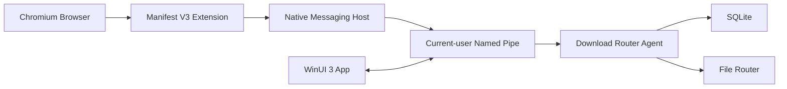

<p align="center">
  
</p>

<h1 align="center">eslee Download Router</h1>

<p align="center">
  Windows에서 Chromium 계열 브라우저의 다운로드를 사이트 규칙에 따라 자동 정리하거나, 파일마다 저장할 하위 폴더를 직접 선택하는 로컬 다운로드 라우터입니다.
</p>

<p align="center">
  <a href="https://github.com/esleeeeee/eslee-Download-Router/releases/latest"></a>
  <a href="https://github.com/esleeeeee/eslee-Download-Router/actions/workflows/ci.yml"></a>
  
  
</p>

<p align="center">
  <strong><a href="https://github.com/esleeeeee/eslee-Download-Router/releases/latest/download/eslee-download-router-setup.exe">최신 설치 파일 다운로드</a></strong>
</p>

## 소개

eslee Download Router는 브라우저의 기본 다운로드를 가로막지 않으면서, 사용자가 만든 사이트 규칙에 맞는 완료 파일만 정리합니다. 규칙이 없거나 Extension, Native Host, Agent 중 하나가 응답하지 않으면 원래 브라우저 다운로드를 그대로 유지하는 fail-open 방식을 사용합니다.

모든 규칙, 다운로드 이력, 설정과 진단 데이터는 로컬 PC의 `%LOCALAPPDATA%\eslee\DownloadRouter`에 저장합니다. 서버, 텔레메트리, 광고 SDK와 전체 방문 기록 수집은 사용하지 않습니다.

## 주요 기능

### Automatic

사이트별 규칙과 저장 위치를 지정하면 다운로드가 완료되고 파일이 안정화된 뒤 자동으로 이동합니다. 도메인과 하위 도메인, 정확한 호스트, URL 포함 조건을 지원합니다.

### SelectSubfolder

다운로드마다 독립된 `FolderSelectionWindow`가 열립니다. 규칙에 지정한 root와 그 하위 폴더만 선택할 수 있고, `..`, 심볼릭 링크, junction과 reparse point를 통한 root 외부 이동은 App과 Agent 양쪽에서 차단합니다.

### FolderTreePicker

폴더 트리는 처음부터 전체를 재귀 검색하지 않습니다. 사용자가 펼친 노드의 직계 자식만 비동기로 읽는 lazy-loading 방식이며 긴 폴더명도 창 폭을 늘리지 않고 표시합니다.

### Download History

실제 최종 파일명, 브라우저 전송 상태, 라우팅 상태와 최종 경로를 표시합니다. 완료 파일의 경로를 바꾸고 같은 안전 이동 절차로 다시 이동할 수 있습니다. 이력 항목을 삭제해도 실제 파일은 삭제하지 않습니다.

### Pending

아직 폴더를 선택하지 않은 파일은 저장 위치 선택 대기 화면에서 관리합니다.

- `나중에 선택`: 현재 App 세션에서만 자동 팝업을 숨깁니다.
- `이번 파일은 이동하지 않기`: 해당 Job을 영구 `Skipped`로 저장합니다.
- `모두 선택 안 함`: 현재 FIFO의 모든 Job을 한 SQLite transaction에서 영구 `Skipped`로 저장합니다.
- 저장된 결정은 Whale, Agent, App 또는 Windows를 다시 시작해도 다시 Pending으로 돌아가지 않습니다.
- 30분이 지난 이전 세션 작업은 대기 목록에는 유지하지만 시작 직후 자동 팝업으로 표시하지 않습니다.

### Browser cancellation

브라우저의 `USER_CANCELED`와 네트워크, 파일, 서버 오류에 따른 interrupted 상태를 구분합니다. 사용자가 취소한 파일은 이동하지 않고 이력에 취소선과 설명으로 남습니다.

### Background

App은 시스템 트레이에 상주합니다. 메인 창의 X 버튼은 종료가 아니라 트레이 숨김이며 트레이 메뉴에서 다시 열 수 있습니다. 설치 시 선택한 경우 Windows 로그인 뒤 `--background`로 자동 시작합니다.

### Theme

System, Light, Dark 테마를 지원합니다. 선택값은 LocalAppData 설정에 저장되고 MainWindow, FolderSelectionWindow, 대화상자, 트레이에서 다시 연 창과 이후 생성되는 창에 공통 적용됩니다.

## 파일 이동 안전성

- 기존 대상 파일을 덮어쓰지 않고 `파일 (1).ext` 형식으로 새 이름을 선택합니다.
- 같은 볼륨에서는 예약된 최종 경로로 이동합니다.
- 다른 볼륨에서는 임시 파일로 복사합니다.
- 복사본의 파일 크기와 SHA-256을 원본과 비교합니다.
- 검증에 성공한 뒤 최종 이름으로 확정하고 원본을 삭제합니다.
- 실패하면 가능한 한 원본을 유지하고 재시도 또는 실패 상태를 기록합니다.
- Agent 장애나 규칙 미매칭은 브라우저 다운로드 자체를 막지 않습니다.

## 지원 환경과 실제 검증 범위

| 환경 | 상태 |
|---|---|
| Windows 11 x64 | 지원 및 실제 설치 검증 완료 |
| Naver Whale  | Extension, Native Messaging, Automatic, SelectSubfolder와 사용자 재시작 검증 완료 |
| Microsoft Edge, Google Chrome | 설치 탐지와 Native Host 등록 구현, 실제 다운로드 검증 전 |
| Brave, Vivaldi, Opera | Native Host 등록 adapter 구현, 실제 브라우저 검증 전 |
| QHD, Windows 125% | Per-Monitor V2, 반응형 폭, 테마와 선택 창 실제 검증 완료 |
| FHD, 4K, Windows 100%, 150% | DIP 및 반응형 경계 자동 검증 완료, 물리 디스플레이 실검증 전 |

Firefox, Safari, 모바일과 Windows 이외 운영체제는 지원하지 않습니다. 자세한 기록은 [브라우저 호환성 문서](docs/BROWSER_COMPATIBILITY.md)를 확인하세요.

## 설치

1. [v1.0.0 Release](https://github.com/esleeeeee/eslee-Download-Router/releases/tag/v1.0.0)에서 `eslee-download-router-setup.exe`를 내려받습니다.
2. 설치 프로그램을 실행합니다. 관리자 권한이 필요 없는 현재 사용자 단위 설치입니다.
3. 설치 프로그램은 App, Agent, Native Host, Extension 파일을 설치하고 지원 브라우저의 HKCU Native Messaging 등록을 구성합니다.
4. Whale에서 `whale://extensions`를 열고 개발자 모드를 켭니다.
5. `압축해제된 확장앱 설치`에서 `%LOCALAPPDATA%\Programs\eslee\DownloadRouter\extension` 폴더를 선택합니다.
6. 표시된 Extension ID가 `gilicenlclaemgiijcjjejilikbooggj`인지 확인합니다.

Native Messaging 레지스트리나 manifest를 사용자가 직접 수정할 필요는 없습니다. 브라우저 스토어 자동 설치는 아직 제공하지 않으므로 확장 로드 단계만 수동입니다. Edge, Chrome과 다른 Chromium 브라우저의 관리 주소는 [수동 확장 설치 문서](docs/MANUAL_EXTENSION_INSTALL.md)에 정리되어 있습니다.

설치 파일은 현재 코드 서명되지 않았습니다. Windows가 게시자를 확인할 수 없다는 경고를 표시할 수 있습니다.

## 간단 사용법

### Automatic 규칙

1. 사이트 규칙에서 도메인 또는 URL 조건을 입력합니다.
2. 처리 방식을 `Automatic`으로 선택합니다.
3. Windows FolderPicker로 저장 폴더를 지정하고 규칙을 저장합니다.
4. 해당 사이트에서 다운로드하면 완료 후 파일이 자동 이동합니다.

### SelectSubfolder 규칙

1. 처리 방식을 `SelectSubfolder`로 선택하고 선택 범위의 root 폴더를 지정합니다.
2. 다운로드를 시작합니다.
3. 표시된 FolderSelectionWindow에서 root 또는 하위 폴더를 선택합니다.
4. 나중에 처리할 파일은 저장 위치 선택 대기 화면에서 다시 엽니다.
5. 메인 창을 닫아 트레이로 숨긴 뒤에는 트레이 메뉴의 `열기` 또는 `저장 위치 선택 대기 열기`를 사용합니다.

## 아키텍처



Extension은 브라우저 이벤트를 전달하고 Native Host는 입력 검증과 Named Pipe 중계만 담당합니다. Agent가 규칙, 작업 상태, SQLite와 파일 이동을 단독으로 소유하며 App은 같은 IPC 계약으로 UI를 제공합니다. 세부 구조와 신뢰 경계는 [ARCHITECTURE.md](ARCHITECTURE.md)를 참고하세요.

## 기술 스택

- C#과 .NET 10
- WinUI 3과 Windows App SDK
- SQLite
- TypeScript Manifest V3 Chromium Extension
- Native Messaging과 current-user Named Pipe
- xUnit과 Node test runner
- PowerShell 자동화
- Inno Setup 사용자 단위 Installer

## 개발

```powershell
git clone https://github.com/esleeeeee/eslee-Download-Router.git
cd eslee-Download-Router
powershell -NoProfile -ExecutionPolicy Bypass -File .\scripts\bootstrap.ps1
powershell -NoProfile -ExecutionPolicy Bypass -File .\scripts\build.ps1
powershell -NoProfile -ExecutionPolicy Bypass -File .\scripts\test.ps1
```

정확한 SDK와 도구 버전, Native Host 등록, Installer 생성 절차는 [DEVELOPMENT.md](DEVELOPMENT.md)에 있습니다.

## 문서

- [ARCHITECTURE.md](ARCHITECTURE.md): 구성 요소, 상태 모델, 신뢰 경계와 배포 구조
- [DEVELOPMENT.md](DEVELOPMENT.md): 개발 환경, 빌드, 브랜치와 브랜딩 관리
- [TESTING.md](TESTING.md): 자동 테스트와 실제 Whale 검증 시나리오
- [CHANGELOG.md](CHANGELOG.md): 버전별 변경 이력
- [docs/BROWSER_COMPATIBILITY.md](docs/BROWSER_COMPATIBILITY.md): 브라우저별 지원 및 실제 검증 범위
- [SECURITY.md](SECURITY.md): 보안 정책과 취약점 제보

## 알려진 제한

- 브라우저 스토어 배포와 자동 확장 설치는 제공하지 않습니다.
- 새 폴더 만들기는 FolderTreePicker 밖에서 수행한 뒤 새로 고침해야 합니다.
- FHD, 4K, Windows 100%, 150% 물리 디스플레이는 아직 직접 검증하지 않았습니다.
- Edge, Chrome, Brave, Vivaldi와 Opera의 실제 다운로드는 아직 검증하지 않았습니다.
- Installer 코드 서명과 자동 업데이트 채널은 제공하지 않습니다.

## 라이선스

라이선스는 아직 결정되지 않았습니다. 공개 저장소라는 사실만으로 재사용 권한이 부여되지는 않습니다.
