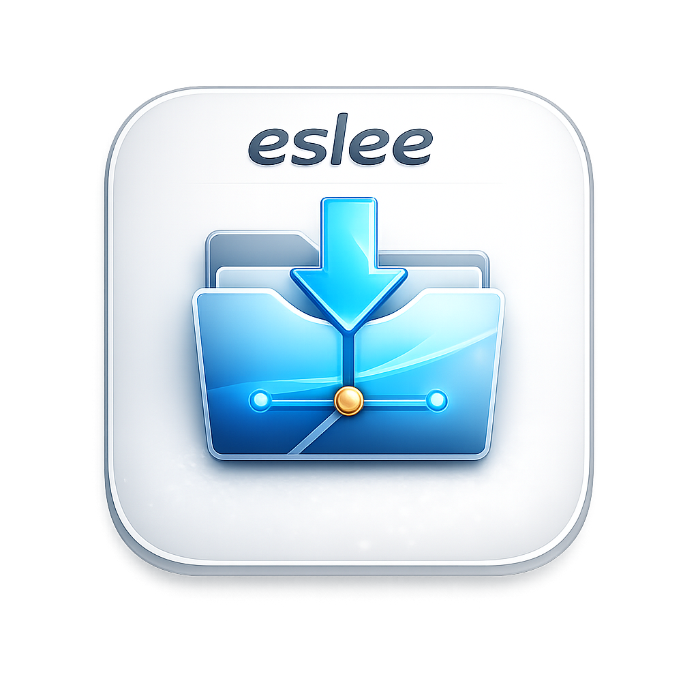
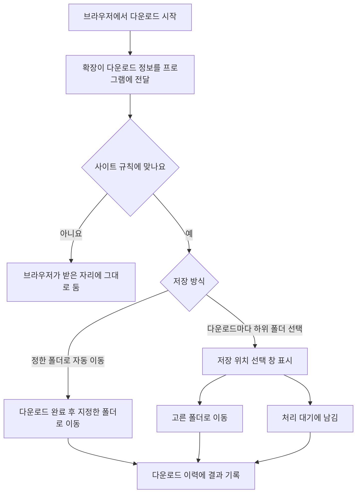

<p align="center">
  
</p>

<h1 align="center">eslee Download Router</h1>

<p align="center">
  브라우저에서 내려받은 파일을 사이트별로 정해 둔 폴더에 자동으로 정리하거나,<br>
  다운로드할 때마다 저장할 하위 폴더를 직접 고를 수 있는 Windows 프로그램입니다.
</p>

<p align="center">
  <a href="https://github.com/esleeeeee/eslee-download-router/releases/latest"></a>
  <a href="https://github.com/esleeeeee/eslee-download-router/actions/workflows/ci.yml"></a>
  
</p>

<p align="center">
  <strong><a href="https://github.com/esleeeeee/eslee-download-router/releases/latest/download/eslee-download-router-setup.exe">설치 파일 내려받기</a></strong>
</p>

---

## 이런 분께 필요합니다

- 특정 사이트에서 받은 파일이 항상 같은 폴더로 가면 좋겠는 분
- 다운로드할 때마다 어느 폴더에 넣을지 직접 고르고 싶은 분
- 지금은 바쁘니 나중에 한꺼번에 정리하고 싶은 분

다운로드 폴더를 열어 파일을 하나씩 옮기는 일을 대신합니다. 브라우저의 기본 다운로드 동작은 그대로 두고, 내려받기가 끝난 파일만 정리합니다.

## 이 프로그램으로 할 수 있는 일

- 정해 둔 사이트에서 받은 파일을 지정한 폴더로 **자동 이동**
- 다운로드할 때마다 **저장 폴더 선택** — 하위 폴더뿐 아니라 `상위 폴더로` 버튼으로 상위·형제 폴더도 선택
- 개별 선택창 상단에서 **파일 이름 변경** — 확장자를 포함해 입력하며, 수정하지 않으면 기본 이름 유지
- 지금 정리하지 않을 파일을 **처리 대기**에 남겨 두고 나중에 정리
- 이미 옮긴 파일의 **저장 위치를 나중에 변경**
- 같은 규칙으로 받은 여러 파일에 **같은 폴더를 한 번에 적용**
- Windows에 로그인하면 **백그라운드로 자동 실행**
- 평소에는 **시스템 트레이에 숨어서** 동작

---

## 1. 설치하기

### 어떤 파일을 받아야 하나요

[최신 릴리스 페이지](https://github.com/esleeeeee/eslee-download-router/releases/latest)에서 **`eslee-download-router-setup.exe`** 를 받으세요.

> 같은 페이지에 있는 **Source code (zip)** 는 설치 파일이 아니라 소스 코드 묶음입니다. 일반 사용자는 받을 필요가 없습니다.

### 설치

1. 받은 `eslee-download-router-setup.exe`를 실행합니다.
2. **관리자 권한이 필요 없습니다.** 현재 사용자 계정에만 설치됩니다.
3. 설치 중 선택 항목
   - **Windows 로그인 시 백그라운드로 자동 시작** — 기본으로 켜져 있습니다.
   - **바탕 화면 바로가기 만들기** — 기본으로 꺼져 있습니다.
4. 설치가 끝나면 프로그램이 실행됩니다.

설치 프로그램이 브라우저와 프로그램을 연결하는 설정도 함께 등록하므로, 레지스트리를 직접 건드릴 필요는 없습니다.

### Windows 경고가 뜨는 경우

이 설치 파일에는 아직 코드 서명이 적용되어 있지 않습니다. 그래서 Windows SmartScreen이 **"Windows의 PC 보호"** 경고를 표시할 수 있습니다.

계속 설치하려면 `추가 정보` → `실행`을 누르세요. 서명이 없다는 것은 게시자를 Windows가 자동으로 확인할 수 없다는 뜻이므로, 반드시 위 공식 릴리스 페이지에서 받은 파일인지 확인한 뒤 진행하세요.

---

## 2. 브라우저 확장 연결하기

프로그램이 다운로드를 인식하려면 브라우저 확장을 한 번 설치해야 합니다. 아직 브라우저 스토어에는 등록되어 있지 않아 수동으로 불러옵니다.

네이버 웨일 기준 절차입니다.

1. 주소창에 `whale://extensions` 를 입력합니다.
2. **개발자 모드**를 켭니다.
3. **압축해제된 확장앱 설치**를 누릅니다.
4. 아래 폴더를 선택합니다.

   ```
   %LOCALAPPDATA%\Programs\eslee\DownloadRouter\extension
   ```

   > 탐색기 주소창에 위 경로를 그대로 붙여 넣으면 폴더가 열립니다.

5. 목록에 나타난 확장의 ID가 `gilicenlclaemgiijcjjejilikbooggj` 인지 확인합니다.

Microsoft Edge, Google Chrome 등 다른 Chromium 계열 브라우저의 확장 관리 주소는 [수동 확장 설치 안내](docs/MANUAL_EXTENSION_INSTALL.md)에 정리되어 있습니다.

프로그램의 **브라우저 연결** 화면에서 설치된 브라우저를 확인하고 확장 관리 페이지를 바로 열 수 있습니다.

---

## 3. 첫 규칙 만들고 확인하기

여기까지 따라 하면 첫 파일이 자동으로 정리되는 것을 확인할 수 있습니다.

1. 프로그램 왼쪽 메뉴에서 **사이트 규칙**을 엽니다.
2. **규칙 기본 정보** — 나중에 알아볼 이름을 적습니다. (예: `예제 자료실`)
3. **어떤 다운로드에 적용할까요** — 사이트 주소를 적고 적용 범위를 고릅니다.
4. **어떤 주소를 확인할까요** — 기본값인 `다운로드를 시작한 웹페이지`를 그대로 두면 대부분 맞습니다.
5. **어디로 보낼까요** — `폴더 선택…`으로 기준 폴더를 지정하고, 저장 방식을 고릅니다.
6. **규칙 요약** — 지금 만든 규칙이 한 문장으로 표시됩니다. 내용이 맞는지 확인하세요.
7. 아래쪽 파란색 **규칙 저장** 버튼을 누릅니다.
8. 해당 사이트에서 파일을 하나 내려받습니다.
9. 저장 방식에 따라 파일이 바로 이동하거나, 저장 위치를 고르는 창이 뜹니다.
10. **다운로드 이력**에서 결과를 확인합니다.

기준 폴더를 입력하면 잠시 뒤 그 폴더를 쓸 수 있는지 자동으로 확인해 알려 줍니다. `사용할 수 없음`이라고 나오면 다른 폴더를 고르세요.

---

## 4. 저장 방식 고르기

| 원하는 동작 | 고를 항목 |
|---|---|
| 항상 같은 폴더로 보내기 | **정한 폴더로 자동 이동** |
| 받을 때마다 하위 폴더를 고르기 | **다운로드마다 하위 폴더 선택** |

### 정한 폴더로 자동 이동

같은 사이트의 파일을 늘 한곳에 모을 때 사용합니다.

- 다운로드가 끝나면 묻지 않고 기준 폴더로 옮깁니다.
- 같은 이름의 파일이 이미 있으면 **덮어쓰지 않고** `파일 (1).확장자` 처럼 새 이름으로 저장합니다.
- 다른 드라이브로 옮길 때는 복사가 끝나고 파일이 온전한지 확인한 뒤에 원본을 정리합니다. 확인에 실패하면 원본을 그대로 둡니다.
- 옮기지 못하면 다운로드 이력에 실패 상태로 남고, 파일은 원래 자리에 있습니다.

### 다운로드마다 하위 폴더 선택

받을 때마다 분류가 달라지는 자료에 사용합니다. 다운로드가 시작되면 저장 위치를 고르는 창이 열립니다.

| 창의 버튼 | 결과 |
|---|---|
| **이 위치로 보내기** | 고른 폴더로 파일을 옮깁니다. |
| **대기 목록에 남기기** | 지금 정리하지 않고 남겨 둡니다. 이 파일은 자동으로 다시 묻지 않습니다. |
| **닫고 대기 목록에 남기기** | 위와 같습니다. 창 오른쪽 위 `X`를 눌러도 결과는 같습니다. |
| **이번 파일은 이동하지 않기** | 이 파일은 옮기지 않고 처리를 끝냅니다. 파일은 브라우저가 받은 자리에 그대로 남습니다. |
| **대기 중인 파일 모두 이동하지 않기** | 지금 대기 중인 파일을 한꺼번에 같은 방식으로 끝냅니다. |
| **선택한 폴더 새로 고침** | 방금 만든 폴더가 목록에 보이지 않을 때 다시 읽습니다. |

고를 수 있는 범위는 규칙에 지정한 **기준 폴더와 그 아래 폴더**로 제한됩니다.

> 자동으로 뜨는 선택 창은 **파일당 한 번만** 표시됩니다. 대기 목록에 남긴 파일은 컴퓨터나 브라우저를 다시 시작해도 다시 묻지 않습니다.

---

## 5. 처리 대기와 다운로드 이력

아직 정리하지 않은 파일은 **다운로드 이력** 화면의 **처리 대기** 필터에서 관리합니다. 별도의 대기 탭은 없습니다.

### 상태 필터

전체 · 처리 대기 · 다운로드 중 · 이동 완료 · 이동하지 않음 · 취소 · 중단 · 실패 또는 재시도

왼쪽 메뉴의 **다운로드 이력** 옆 숫자 배지가 현재 처리 대기 개수입니다. 0이면 표시되지 않습니다. **대시보드**의 `저장 위치 선택 대기` 카드에서 `처리 대기 목록 열기`를 눌러 바로 이동할 수도 있습니다.

### 처리 대기에서 할 수 있는 일

- 규칙별로 묶어 보고, 규칙마다 기준 폴더를 함께 확인
- 파일 하나씩 저장 위치 지정 또는 이동하지 않기
- 같은 규칙의 파일 여러 개를 골라 **같은 하위 폴더를 한 번에 적용**
- 규칙 단위로 **대기 파일 모두 이동하지 않기**

> 서로 다른 규칙의 파일을 함께 고르면 기준 폴더가 다르므로 일괄 폴더 적용이 꺼집니다. 규칙별로 나누어 처리하세요.

### 이력 삭제는 파일 삭제가 아닙니다

`이력에서 삭제`, `선택 항목 이력 삭제`, `취소된 이력 정리`는 **프로그램의 기록만** 지웁니다. 이미 내려받았거나 옮긴 **실제 파일은 삭제되지 않습니다.**

이동이 끝난 파일도 `다른 위치로 이동`으로 다시 옮길 수 있습니다.

---

## 6. 트레이와 자동 시작

프로그램은 평소 시스템 트레이(작업 표시줄 오른쪽 알림 영역)에 숨어서 동작합니다.

- 창의 **`X` 버튼은 종료가 아니라 트레이로 숨기기**입니다. (일반 설정에서 바꿀 수 있습니다.)
- 트레이 아이콘에 마우스를 올리면 `eslee Download Router` 툴팁이 표시됩니다.
- **트레이 아이콘을 두 번 클릭**하면 창이 열립니다.
- 트레이 아이콘을 **오른쪽 클릭**하면 메뉴가 열립니다.
  - `eslee Download Router 열기`
  - `저장 위치 선택 대기 열기`
  - `일반 설정`
  - `종료`
- **완전히 끄려면** 트레이 메뉴의 `종료`를 사용하세요.

> 트레이 아이콘을 **한 번만 클릭했을 때는 창이 열리지 않습니다.** 두 번 클릭하거나 오른쪽 클릭 메뉴를 사용하세요.

### 일반 설정에서 바꿀 수 있는 것

| 항목 | 설명 |
|---|---|
| Windows 로그인 시 백그라운드로 실행 | 로그인하면 창 없이 자동 실행합니다. 설치할 때 켜 두었다면 이미 켜져 있습니다. |
| 창 닫기 버튼 동작 | `트레이로 최소화`(기본) 또는 `프로그램 UI 완전 종료` |
| 테마 | `시스템 설정`(기본) · `라이트` · `다크` |

---

## 7. 업데이트한 뒤에는 확장을 새로 고치세요

새 버전이 나왔는지는 프로그램의 **정보** 화면에서 확인할 수 있습니다. 프로그램이 하루에 한 번 자동으로 확인하고, `지금 확인` 버튼으로 직접 확인할 수도 있습니다. 새 버전이 있으면 `Release 페이지 열기`로 내려받는 페이지가 열립니다. 자동으로 설치되지는 않습니다.

> ⚠️ **프로그램을 새 버전으로 업데이트했다면 이 항목을 꼭 읽어 주세요.**

새 버전을 설치하면 확장 파일도 함께 바뀝니다. 그런데 **브라우저는 이전에 읽어 둔 확장 코드를 계속 사용할 수 있습니다.** 이 상태에서는 새로 받은 파일이 프로그램에 나타나지 않습니다.

업데이트한 뒤에는 아래를 한 번 해 주세요.

1. `whale://extensions` 를 엽니다. (다른 브라우저는 해당 확장 관리 주소)
2. **eslee Download Router** 항목의 **새로 고침(↻)** 버튼을 누릅니다.
3. 브라우저를 **완전히 종료했다가 다시 실행**합니다.

프로그램이 확장 버전이 맞지 않다고 판단하면 **대시보드와 진단 화면에 경고**가 표시됩니다. 이 경고가 보이면 위 절차를 진행하세요.

> 확장을 새로 고치기 전까지 새 다운로드는 프로그램에 등록되지 않습니다. 이는 예전에 받아 둔 파일이 새 작업으로 잘못 등록되는 것을 막기 위한 동작입니다. **브라우저의 다운로드 자체는 이 경우에도 정상 동작합니다.**

---

## 8. 꼭 알아둘 점

- **Windows 11 (64비트)** 에서 동작합니다.
- **Chromium 계열 브라우저**용입니다. Firefox, Safari, 모바일은 지원하지 않습니다.
  - 네이버 웨일 · Microsoft Edge · Google Chrome — 공식 지원
  - Brave · Vivaldi · Opera — 호환 지원(실제 다운로드 검증 전)
- 브라우저 **확장을 연결해야** 동작합니다.
- 프로그램이 **실행 중이어야** 다운로드가 정리됩니다. 트레이에 숨어 있어도 실행 중입니다.
- 프로그램이나 확장에 문제가 있어도 **브라우저 다운로드 자체를 막지 않습니다.** 정리만 건너뜁니다.
- 같은 이름의 파일을 **덮어쓰지 않습니다.**
- 설치 파일에 **코드 서명이 적용되어 있지 않습니다.**
- 브라우저 스토어를 통한 확장 자동 설치와 프로그램 자동 업데이트는 제공하지 않습니다.
- 폴더 선택 창에서 **새 폴더를 만들 수는 없습니다.** 탐색기에서 만든 뒤 `선택한 폴더 새로 고침`을 누르세요.
- 설정과 기록은 **현재 Windows 사용자 계정에만** 저장됩니다. 다른 계정과 공유되지 않습니다.

---

## 9. 문제가 생겼을 때

### 새로 받은 파일이 프로그램에 나타나지 않아요

1. **대시보드에 확장 관련 경고**가 있는지 확인합니다.
2. 있으면 [7. 업데이트한 뒤에는 확장을 새로 고치세요](#7-업데이트한-뒤에는-확장을-새로-고치세요)대로 확장을 새로 고치고 브라우저를 다시 시작합니다.
3. **사이트 규칙**에서 해당 규칙이 `사용 중`인지 확인합니다.
4. 규칙의 사이트 주소와 `어떤 주소를 확인할까요` 설정이 실제 다운로드와 맞는지 확인합니다.
5. **진단 및 문제 해결** 화면에서 `Agent 연결 테스트`를 눌러 봅니다.
6. 그래도 안 되면 [Issue](https://github.com/esleeeeee/eslee-download-router/issues)로 알려 주세요.

> 규칙에 맞지 않는 다운로드는 원래 자리에 그대로 저장됩니다. 이력이 비어 있는 것이 정상일 수 있습니다.

### 예전에 받은 파일이 처리 대기에 다시 나타나요

1. **정보** 화면에서 최신 버전인지 확인합니다.
2. 확장을 새로 고치고 브라우저를 다시 시작합니다.
3. 그래도 계속되면 [Issue](https://github.com/esleeeeee/eslee-download-router/issues)로 알려 주세요.

대기 목록의 항목을 정리해도 실제 파일은 삭제되지 않으니 안심하고 정리하셔도 됩니다.

### 저장 위치 선택 창이 뜨지 않아요

1. 규칙의 저장 방식이 `다운로드마다 하위 폴더 선택`인지 확인합니다.
2. 규칙이 `사용 중`인지 확인합니다.
3. 대시보드에 확장 경고가 있는지 확인합니다.
4. 이미 한 번 창을 닫았거나 `대기 목록에 남기기`를 누른 파일은 다시 뜨지 않습니다. **다운로드 이력 → 처리 대기**에서 처리하세요.

### 파일이 옮겨지지 않아요

1. 기준 폴더가 지금도 존재하고 쓸 수 있는지 확인합니다. (사이트 규칙 화면에 사용 가능 여부가 표시됩니다.)
2. 다른 프로그램이 그 파일을 열어 두고 있지 않은지 확인합니다.
3. 다운로드가 완전히 끝났는지 확인합니다.
4. **다운로드 이력**의 `실패 또는 재시도` 필터에서 상태와 오류를 확인합니다.

### 프로그램 창이 사라졌어요

트레이 아이콘을 **두 번 클릭**하거나, **오른쪽 클릭 → `eslee Download Router 열기`** 를 선택하세요. 한 번 클릭으로는 열리지 않습니다.

### 확장이 연결되지 않아요

1. 확장 ID가 `gilicenlclaemgiijcjjejilikbooggj` 인지 확인합니다.
2. 개발자 모드가 켜져 있는지 확인합니다.
3. 확장을 새로 고치고 브라우저를 완전히 다시 시작합니다.
4. **진단 및 문제 해결** 화면에서 연결 상태를 확인합니다.
5. 회사나 학교 PC라면 보안 정책이 확장이나 개발자 모드를 막고 있을 수 있습니다.

---

## 10. 내 정보는 어디에 저장되나요

모든 데이터는 **내 컴퓨터에만** 저장됩니다.

| 저장되는 것 | 위치 |
|---|---|
| 규칙, 다운로드 이력 | `%LOCALAPPDATA%\eslee\DownloadRouter\data\download-router.db` |
| 프로그램 설정 | `%LOCALAPPDATA%\eslee\DownloadRouter\config.local.json` |
| 로그 | `%LOCALAPPDATA%\eslee\DownloadRouter\logs\` |
| 프로그램 본체 | `%LOCALAPPDATA%\Programs\eslee\DownloadRouter\` |

### 무엇이 저장되나요

- 내려받은 **파일 이름**과 **저장 경로**
- 다운로드 **출처 주소** — 계정 정보, 물음표 뒤 검색어(쿼리), `#` 뒷부분은 저장하지 않습니다.
- 규칙, 상태, 시각 등 정리에 필요한 정보
- 로그 파일에는 **파일 이름이 포함될 수 있습니다.** 프로그램에 예기치 않은 오류가 났을 때 남는 `app-unhandled.log`에는 **전체 경로가 그대로 남을 수 있습니다.**

### 하지 않는 것

- 내 정보를 외부 서버로 보내지 않습니다. 계정 가입도 필요 없습니다.
- 분석, 광고, 원격 통계 수집이 없습니다.
- 브라우저의 전체 방문 기록을 수집하지 않습니다. 다운로드 관련 정보만 사용합니다.
- 브라우저 확장과 프로그램은 **내 컴퓨터 안에서만** 통신합니다.

한 가지 예외로, 프로그램은 새 버전이 나왔는지 알려주기 위해 GitHub의 **공개 배포 정보를 읽기만** 합니다. 이때 내 파일, 규칙, 다운로드 기록 등 개인적인 내용은 아무것도 보내지 않으며, 자동 확인은 하루 한 번으로 제한됩니다. 인터넷이 안 되어도 다운로드 정리는 평소처럼 동작합니다.

프로그램을 제거해도 규칙과 이력은 남습니다. 완전히 지우려면 위 `%LOCALAPPDATA%\eslee\DownloadRouter` 폴더를 직접 삭제하세요.

> Issue에 로그를 첨부하실 때는 파일 이름이나 경로 등 개인적인 내용이 포함되어 있지 않은지 먼저 확인해 주세요. 무엇이 남는지는 [SECURITY.md의 「로그에 기록되는 정보」](SECURITY.md#로그에-기록되는-정보)에 정리되어 있습니다.

자세한 보안 설계는 [SECURITY.md](SECURITY.md)를 참고하세요.

---

## 11. 어떻게 동작하나요



---

## 개발자를 위한 정보

```powershell
git clone https://github.com/esleeeeee/eslee-download-router.git
cd eslee-download-router
powershell -NoProfile -ExecutionPolicy Bypass -File .\scripts\bootstrap.ps1
powershell -NoProfile -ExecutionPolicy Bypass -File .\scripts\build.ps1
powershell -NoProfile -ExecutionPolicy Bypass -File .\scripts\test.ps1
```

설치 파일 생성, 확장 빌드, Native Host 등록 등 자세한 절차는 [DEVELOPMENT.md](DEVELOPMENT.md)에 있습니다.

C# / .NET 10, WinUI 3, SQLite, TypeScript 기반 Chromium 확장, Inno Setup으로 만들어졌습니다.

| 문서 | 내용 |
|---|---|
| [ARCHITECTURE.md](ARCHITECTURE.md) | 구성 요소, 상태 모델, 신뢰 경계 |
| [DEVELOPMENT.md](DEVELOPMENT.md) | 개발 환경, 빌드, 확장 버전 정책 |
| [TESTING.md](TESTING.md) | 자동 테스트와 수동 검증 시나리오 |
| [CHANGELOG.md](CHANGELOG.md) | 버전별 변경 이력 |
| [SECURITY.md](SECURITY.md) | 보안 설계와 취약점 제보 |
| [docs/MANUAL_EXTENSION_INSTALL.md](docs/MANUAL_EXTENSION_INSTALL.md) | 브라우저별 확장 설치와 개발용 등록 |
| [docs/BROWSER_COMPATIBILITY.md](docs/BROWSER_COMPATIBILITY.md) | 브라우저별 검증 범위 |

## 라이선스

라이선스는 아직 결정되지 않았습니다. 공개 저장소라는 사실만으로 재사용 권한이 부여되지는 않습니다.
